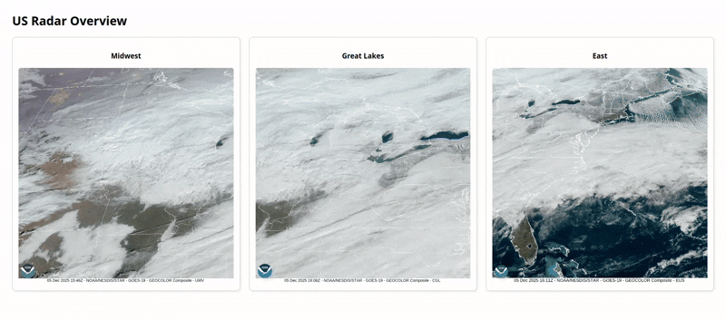

# WeatherDash

Hi there! Welcome to my repository about weather! The goal of this repo is to:

Build a containerized module to retrieve live weather data in multiple regions, compile it into GIFs, and continually display it on a hosted website.

  

### Things you need to know if you wanted to run this setup yourself:
1) You'll need to create and safely store an OpenWeather API key.

This is completely free to do and use, so I highly recommend!

2) You need Docker installed on your system

This entire setup is intented to be portable and containerized, and I chose to use Docker for this objective due to its commonality and relative simplicity.

## How does this Repo work?

The way I chose to go about the objective was to take two routes--one for the radar with web support, and the other for weather data and dashboard support.

### Route 1: Radar and Web

This carries the majority of the focus points, so I'll include more detailed documentation for this one.

The flow looks like the following:

1) Establish an OpenWeather API key
2) Find the regions you want to pull satellite data from
3) Design a script to continually poll/request the data from the appropriate endpoint
4) Process the data and turn it into GIFs, create logic to maintain latest x hours of imagery
5) Design a website/platform to mount the GIFs into
6) Serve the website

Lastly, while this git repo itself may look simple at first, there is actually a lot going on inside the docker containers that isn't being immediately shown.

To explain how this all works, let's begin with the setup.

#### Setup

(to be continued)
